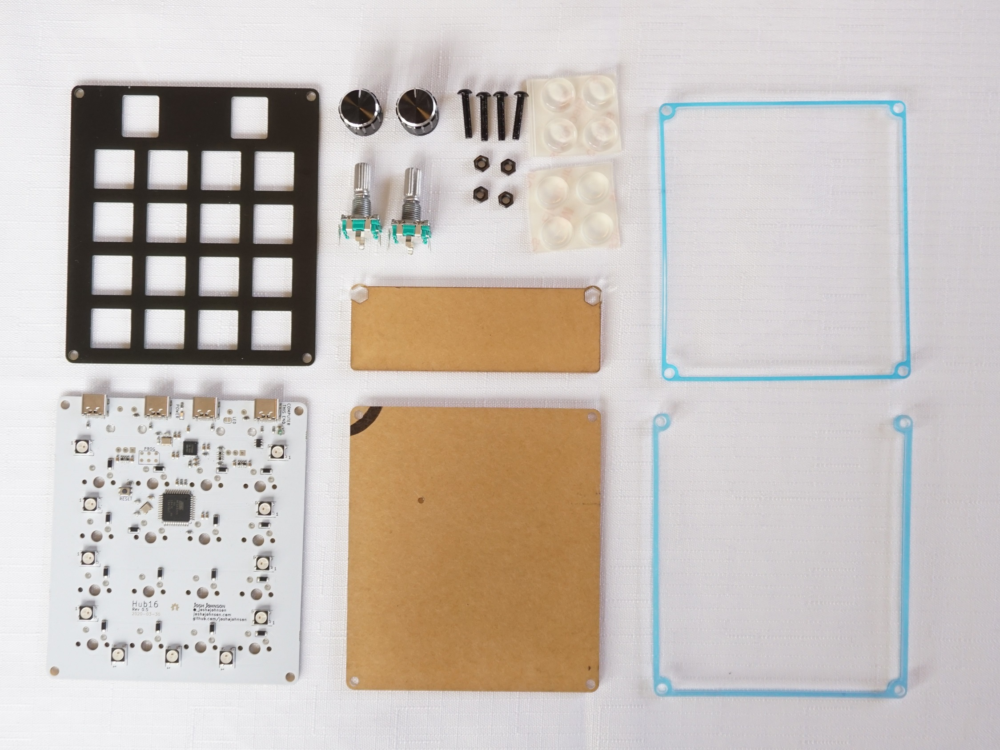
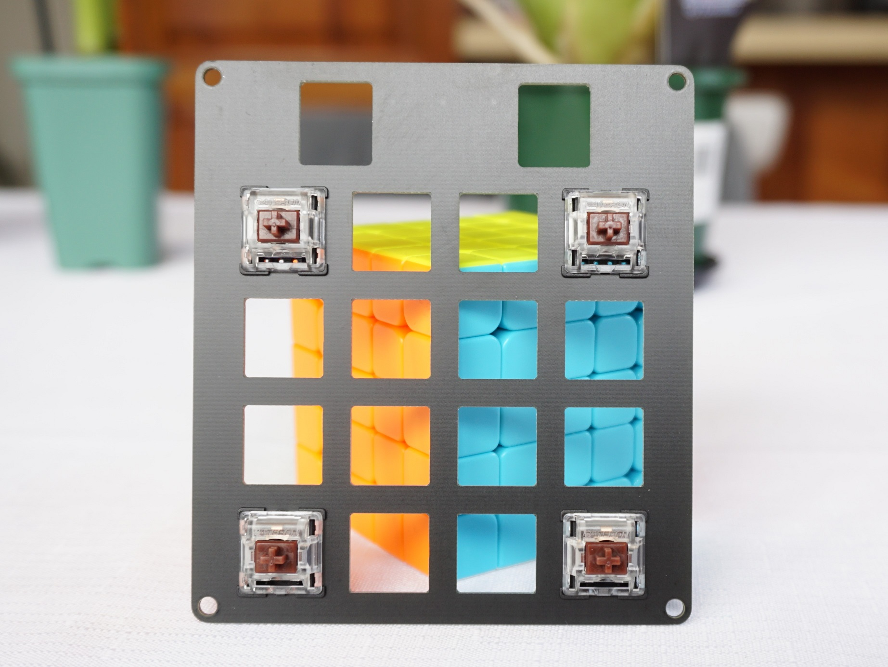
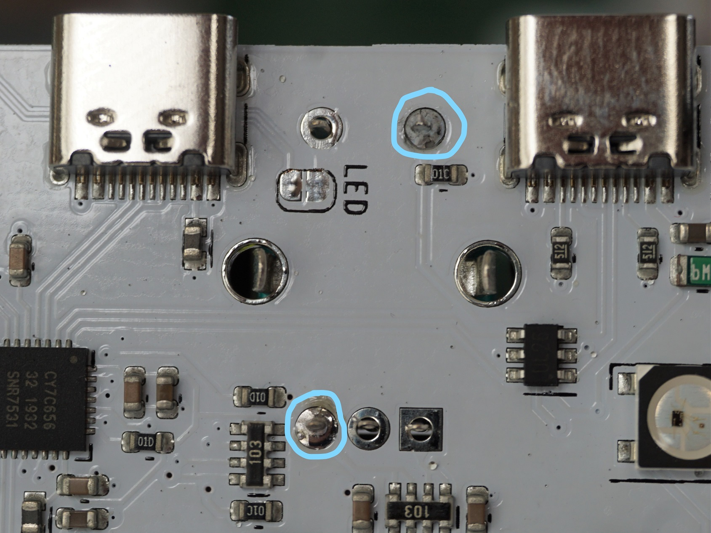
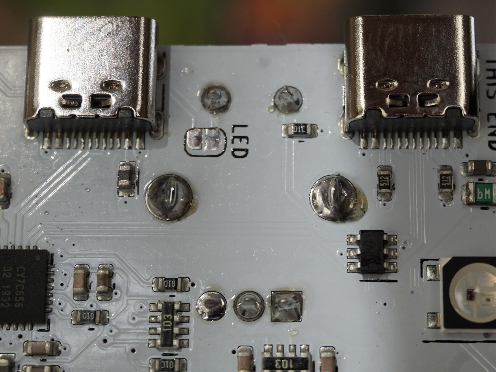
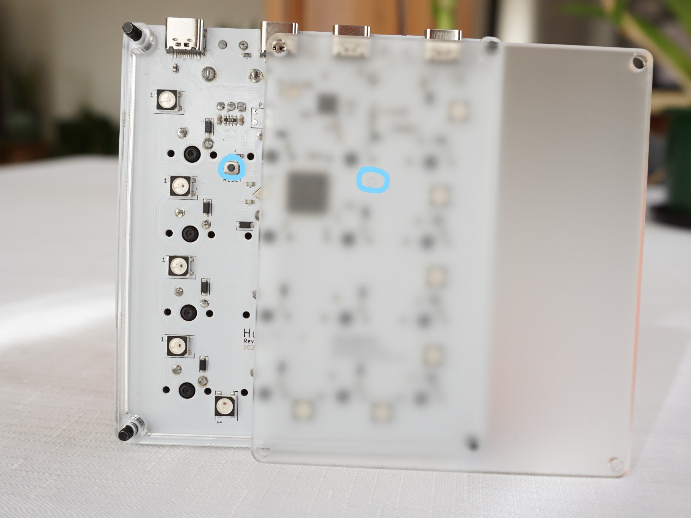
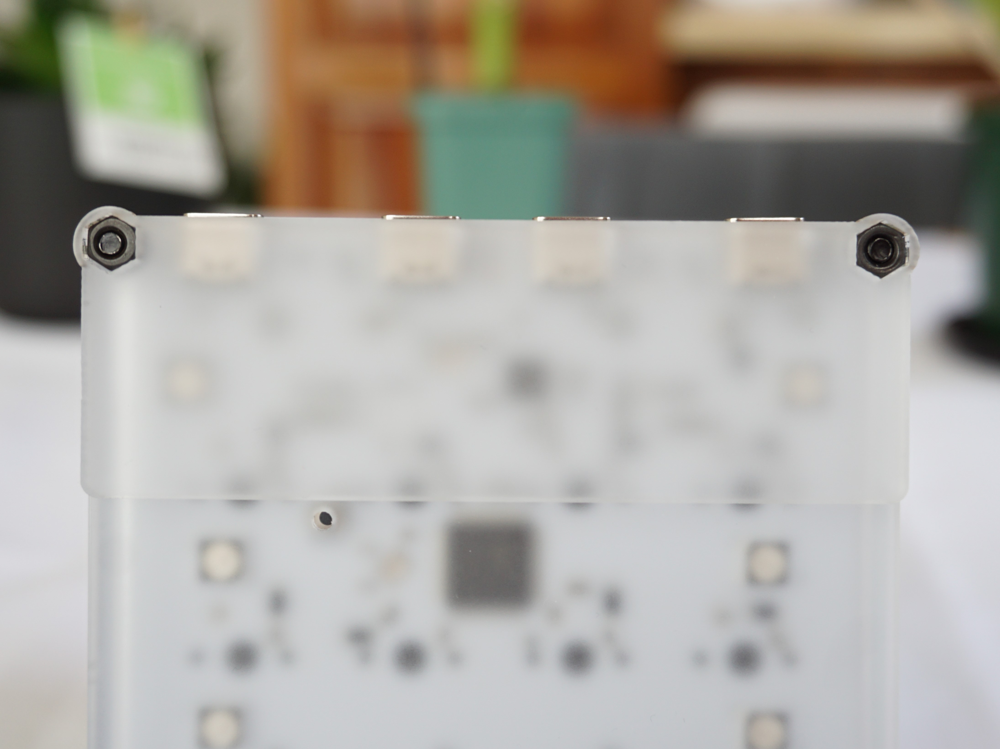
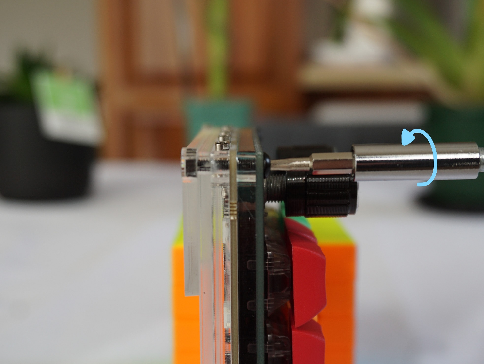
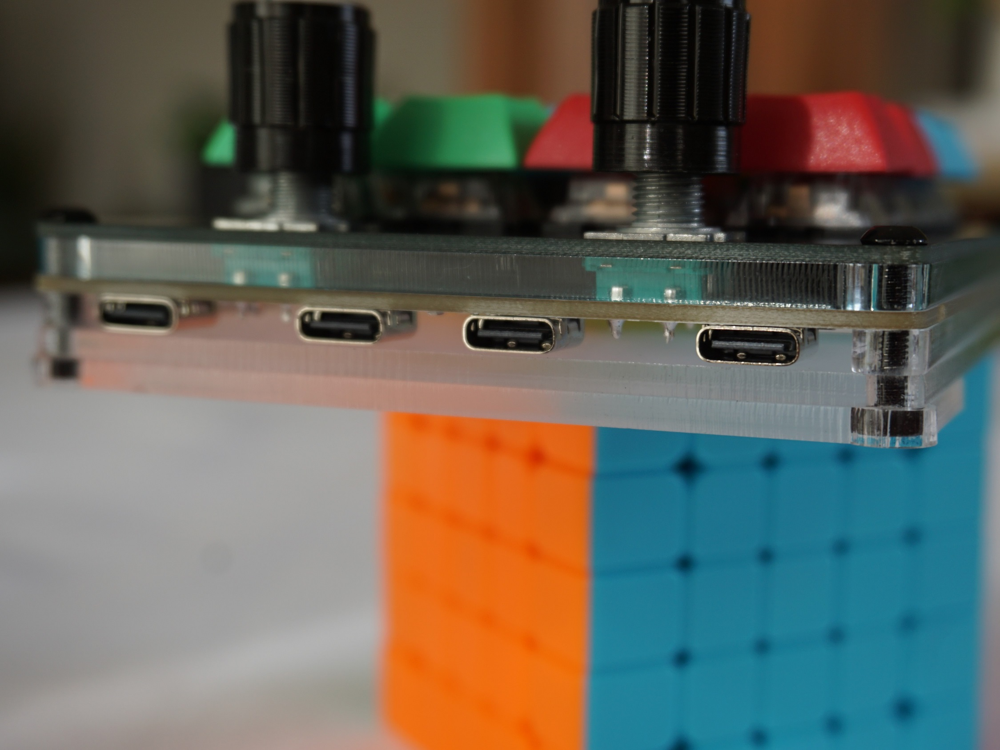
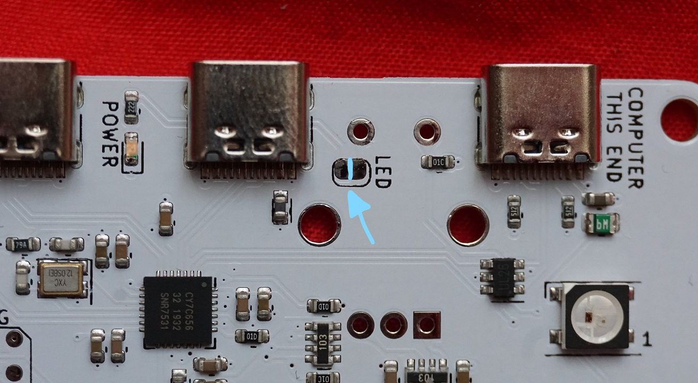

# Assembly Instructions

Before assembling the board, ensure you have all of the required parts.

### Acrylic Case
* Assembled keyboard PCB
* Top cover PCB
* Laser cut acrylic - 4 pieces
* 2 * Rotary encoders (20mm recommended)
* 2 * Rotary encoder knobs
* 4 * M3, 16mm cap head bolts
* 4 * M3 nuts
* 4 * Rubber feet
* 16 * Cherry MX Key Switches (not shown)
* 16 * 1U Cherry MX Keycaps (not shown)

## Step 0: Check PCB
All boards purchased from me have been 100% functionally tested, however there is a chance for damage to occur during freight.

Prior to testing each contact, run `Software/test.ahk` on Windows for the board to type the key being pressed, as that script removes the key wrapping used to differentiate the keyboard. Assuming you have not configured your mac or Linux machine yet, you do not need to run any software before following the below.

**Check the key switches by using tweezers to short the key switch pins together.**  

**Check the encoders by placing encoder against pins and rotating.**  
You may need to angle the encoder down to ensure it has good contact.

**Check the USB hub by connecting a device to each port, in both orientations.**  
You should see a your device appear on each port.

### **If there are any issues getting the above to work, please get in touch before proceeding to assemble the board.**

## Step 1: Insert Outside Keys

Step one is to insert key switches into all four corners of the top cover, ensuring that they click in place and sit flush with the PCB. 

## Step 2: Add Spacer and PCB, and screw together

Place the rectangular spacer underneath the top cover, followed by the PCB. Then place the 4 bolts through the parts and snug together with the provided nuts. This ensures everything is held together during soldering.

## Step 3: Solder Outside Keys

With parts flush with each other, solder in the four keyswitches to keep everything in place. Before soldering in a key, confirm both legs are poking through the PCB as it is much harder to fix after you have soldered one leg in. (Note: image is of different key, just highlighting what to check for). 

## Step 4: Install and Solder Remaining Keys

With the four keys in place and the enclosure in place (no gaps, nothing out of alignment), install and solder in the the remaining keyswitches. 

## Step 5: Install Rotary Encoders

Insert the rotary encoders, ensuring that the pins are straight.

Tack two of the pins in, as this will allow us to adjust the angle of the encoders if required. 

Check if the encoders are square and are in alignment with each other. If not, melt the solder to one (or both) of the pins on the back and move until in the correct position.

With the encoders in the correct position, solder in all pins, including the large mechanical legs.

## Step 6: Assemble remaining enclosure

After removing the nuts from each bolt, add the "U" shaped spacer, followed by the rectangular bottom plate, ensuring the hole is lined up with the reset button.

Thread on all nuts to keep the assembly together. The small spacer can be placed on one end of the case to give an incline. It is best fit when the nuts are loose, as they can be rotated into position easier. 

Once the spacer is in place, torque the bolts to keep it in position. If loose, flip the spacer over as often the other side is a tighter fit.

The spacer should stay in place once assembled. Finally, add rubber feet if required to adjust angle. If the Hub16 is not level and rocks on your desk, shim a low corner with a few pieces of sticky tape (I usually place between case and spacer on a back corner) until it is not longer rocking.

## Step 7: Add Encoder Knobs and Keycaps

With those steps done, add the encoder knobs along with your keycaps and the board is ready to go!

## Disabling Power LED

If you find the power LED annoying and would like to disable it, cut the jumper (along the blue line) labeled LED near the USB ports. It can be re-enabled by soldering the jumper shut again. 

If there are any issues with the assembly process get in touch and I'll do my best to help.
