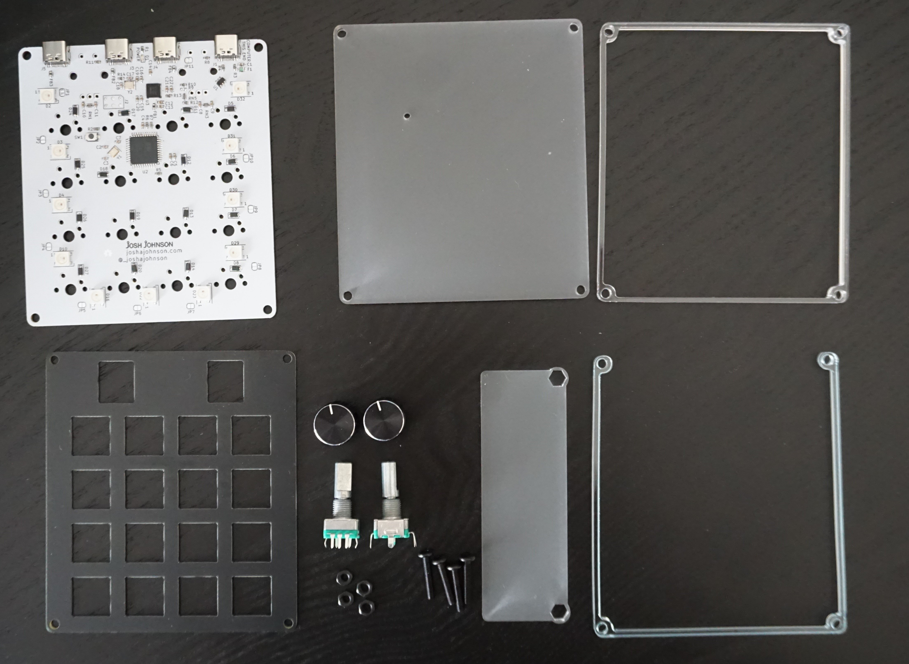
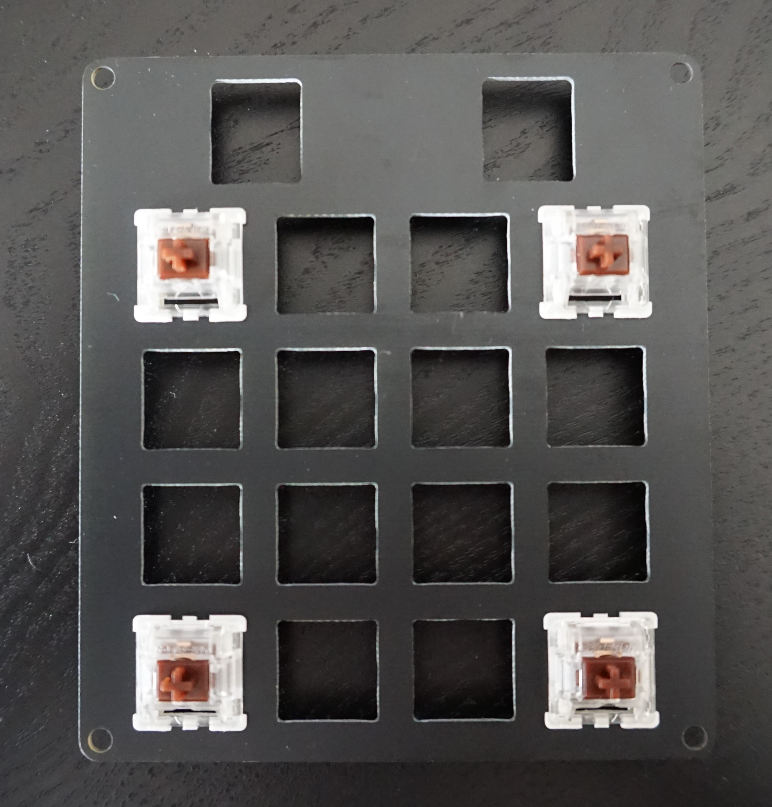
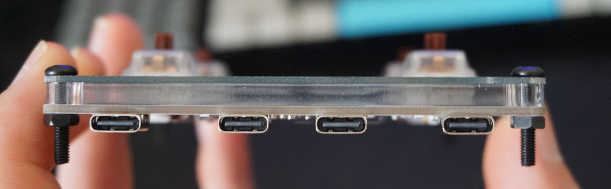
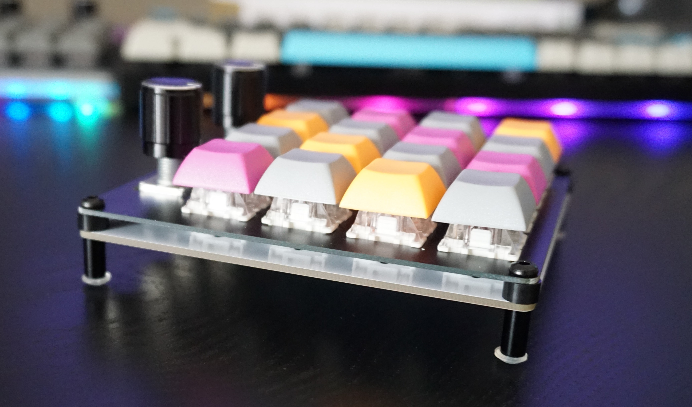
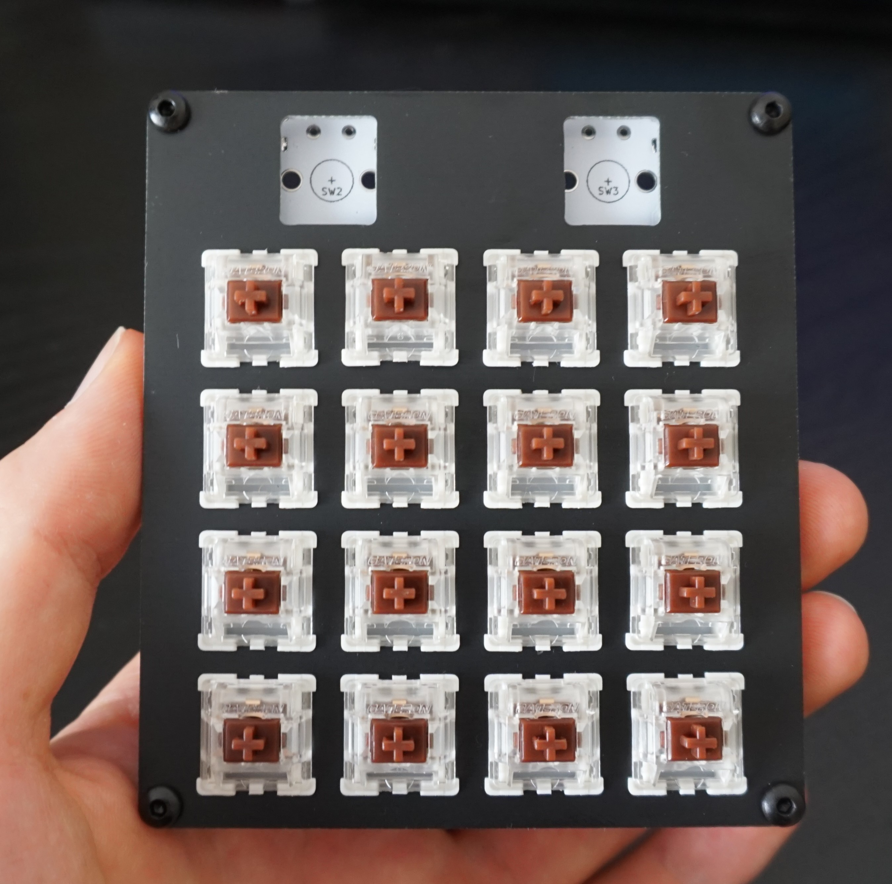
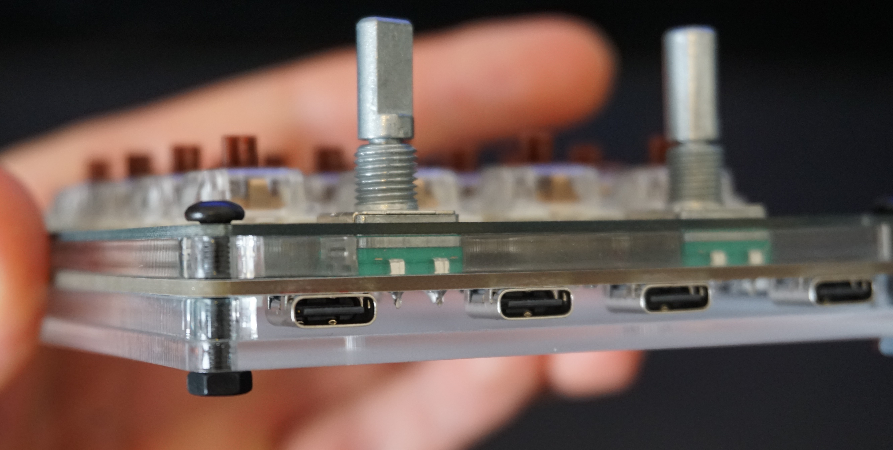
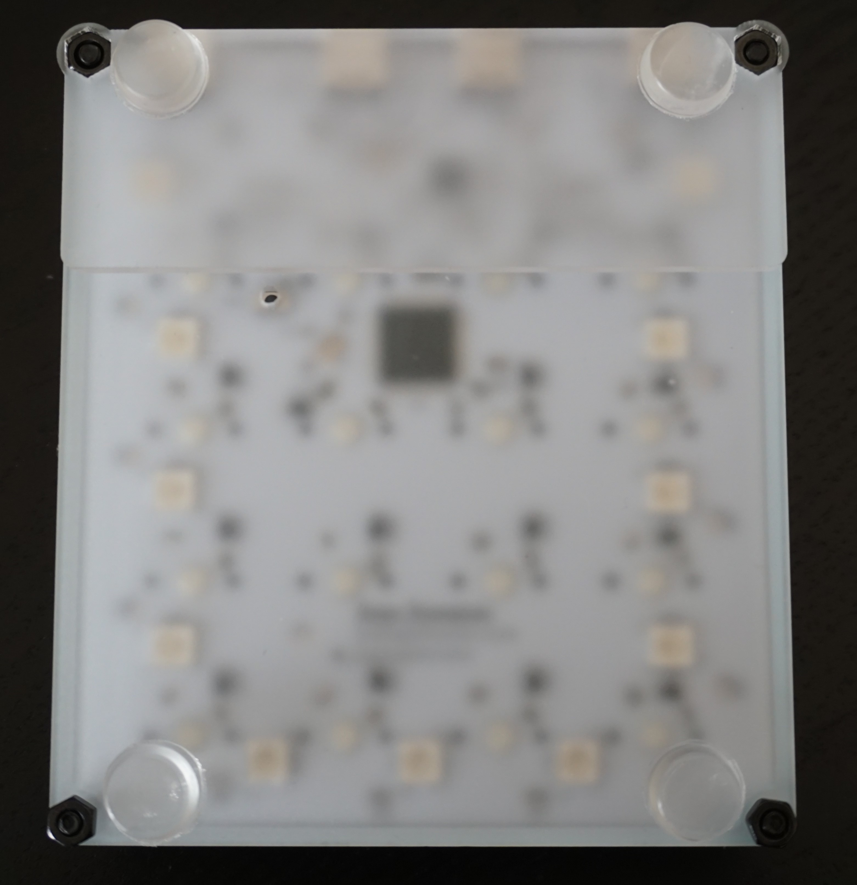

# Assembly Instructions

Hub16 comes with two case options: acrylic and barebones, and the hardware required and mechanical assembly is slightly different for each, so before starting ensure you have all of the required hardware.

## Acrylic Case
### Parts Required
* Assembled keyboard PCB
* Top cover PCB
* Laser cut acrylic - 4 pieces
* 16 * Cherry MX Key Switches - Plate Mount (3 Pin)
* 16 * 1U Cherry MX Keycaps
* 2 * Rotary encoders (20mm recommended)
* 2 * Rotary encoder knobs
* 4 * M3, 16mm cap head bolts
* 4 * M3 nuts
* 4 * Rubber feet

## Barebones Case
### Parts Required
* Assembled keyboard PCB
* Top cover PCB
* 16 * Cherry MX Key Switches - Plate Mount (3 Pin)
* 16 * 1U Cherry MX Keycaps
* 2 * Rotary encoders (20mm recommended)
* 2 * Rotary encoder knobs
* 4 * M3, 10mm cap head bolts
* 4 * M3, 4mm spacers
* 4 * M3, 10mm threaded nuts

## Instructions

