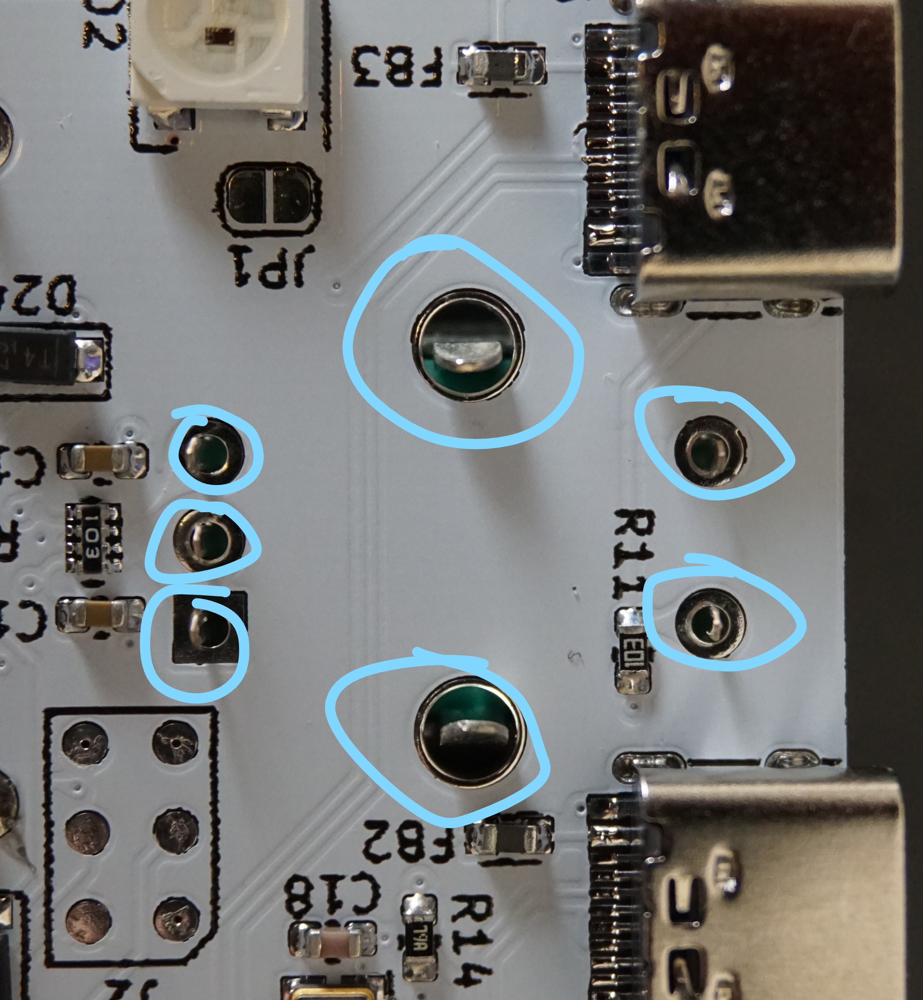

# Assembly Instructions

Hub16 comes with two case options: acrylic and barebones, and the hardware required and mechanical assembly is slightly different for each, so before starting ensure you have all of the required hardware.

## Acrylic Case
### Parts Required
* Assembled keyboard PCB
* Top cover PCB
* Laser cut acrylic - 4 pieces
* 16 * Cherry MX Key Switches - Plate Mount (3 Pin)
* 16 * 1U Cherry MX Keycaps
* 2 * Rotary encoders (20mm recommended)
* 2 * Rotary encoder knobs
* 4 * M3, 16mm cap head bolts
* 4 * M3 nuts
* 4 * Rubber feet

## Barebones Case
### Parts Required
* Assembled keyboard PCB
* Top cover PCB
* 16 * Cherry MX Key Switches - Plate Mount (3 Pin)
* 16 * 1U Cherry MX Keycaps
* 2 * Rotary encoders (20mm recommended)
* 2 * Rotary encoder knobs
* 4 * M3, 10mm cap head bolts
* 4 * M3, 4mm spacers
* 4 * M3, 10mm threaded nuts

## Instructions
Ensure that you have all required hardware. The below image is for the Acrylic Case, if you are going barebones you will not have the acrylic parts, but will have 4 * 4mm unthreaded spacers, and 4 * 10mm threaded nuts instead. Both kits will come with an assortment of rubber feet (not shown).

Step one is to insert key switches into all four corners of the top cover, ensuring that they click in place and sit flush with the PCB. 

Before mating the cover / switches with the main PCB, insert the rectangular acylic spacer (top right in first image) between the boards, and thread the bolts in touch tight to stop the assembly from falling appart. 

If assembling the barebones kit, instead of the acrylic spacer place the 4mm unthreaded nut, followed by the threaded nut as shown below.

Then insert all switches ensuring that they click in to position. If you have 5 pin key switches, trim off the plastic pins as this will ensure everything fits together nicely. 

Before soldering the keys, ensure that all pins poke through the main PCB and are not bent or damaged. It is much easier to fix it before soldering the pins in. Once everything looks good, solder all of the key switches into position. 

Insert the rotary encoder, noting that you may need to bend the pins inward / straighten them up to make everything fit nicely. This step can be a bit finicky, I find that placing the three pins into position first allows the others to fit easier. As with the switches, ensure all pins are poking through the main PCB and that the encoder is perpindicular to the main PCB before soldering everything into position.

Add the other acrylic spacer, ensuring the missing edge is lined up with the USB connectors, along with placing the bottom plate such that the small hole lines up with the reset switch. 

Add the acrylic spacer and rubber feet as required to get desired height and angle of keyboard, before snugging up the bolts with a 2mm allen key. If you are having issues getting the spacer to fit, loosen off the screws to allow the nuts to turn before fitting the spacer. 

With those steps done, add the encoder knobs along with your keycaps and the board is ready to go! If there are any issues with the assembly process get in touch and I'll do my best to help.
