# Assembly Instructions

Click the below to jump to the correct instructions:

[Acrylic Case](#acrylic-case)

[Barebones Case]() (TODO)

[Disabling Power LED](#disabling-power-LED)

## Acrylic Case

Before assembling the board, ensure you have all of the required parts.

* Top cover / Plate PCB
* Assembled keyboard PCB
* Laser cut acrylic - 4 pieces
* 2 * Rotary encoders (20mm recommended)
* 2 * Rotary encoder knobs
* 4 * 4mm M2 cap head bolts
* 4 * 8mm M2 cap head bolts
* 4 * 8mm female threaded standoffs
* 4 * Rubber feet (optional)
* 16 * Cherry MX Key Switches (not shown)
* 16 * 1U Cherry MX Keycaps (not shown)

You will also require the following tools:

* Soldering iron and solder
* 1.5mm allen key

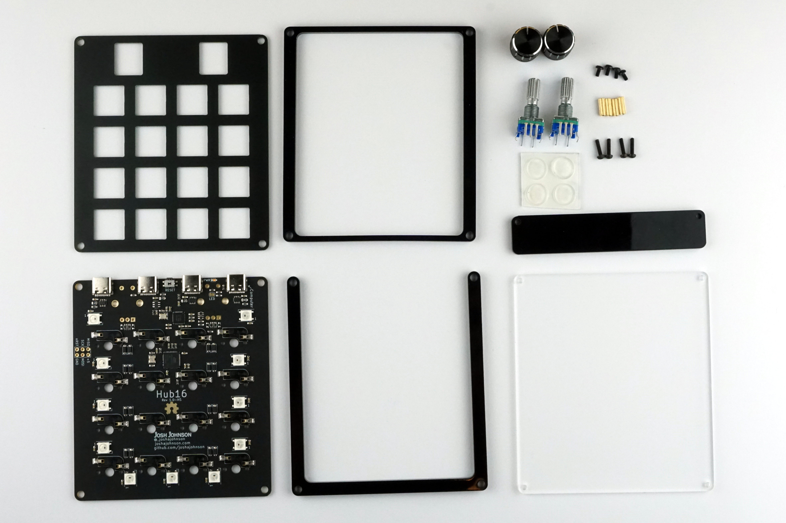

### Step 0: Check PCB

Whilst we do our best to ensure the PCBs work, there may be issues that slip through QC or the boards may be damaged in freight. As such you should test the PCB before continuing.

Boards come preloaded with QMK for testing, and using their "Key Tester -> Test Matrix" option is the easiest way to ensure the board works.

**Check the key switches by using tweezers to short the key switch pins together.**  
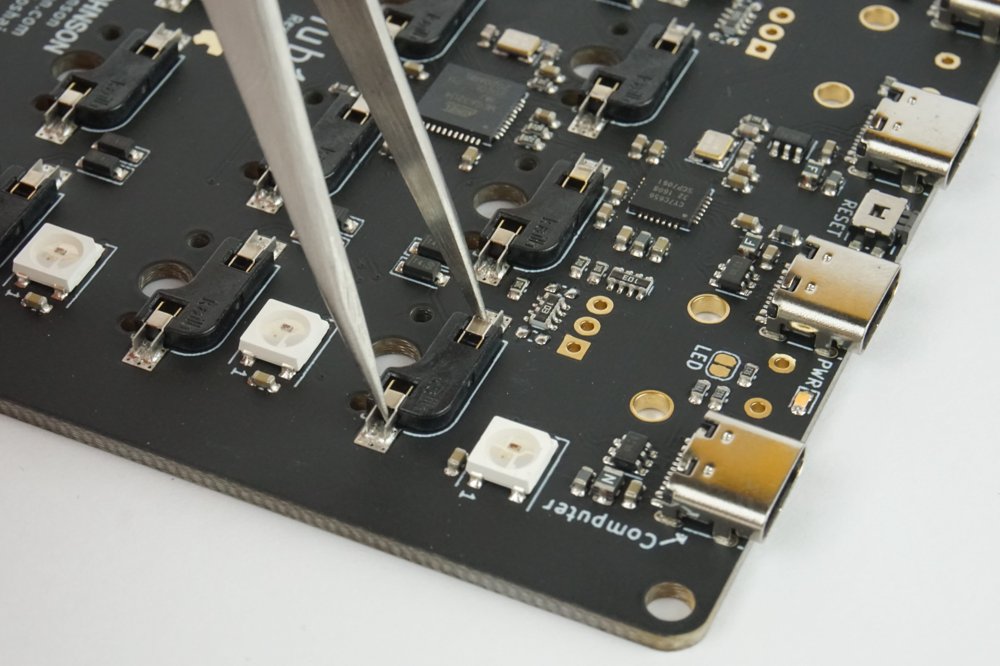

**Check the encoders by placing encoder against pins and rotating.**  
You may need to angle the encoder down to ensure it has good contact. Also test the encoder switch by shorting the two pins towards the top of the PCB.

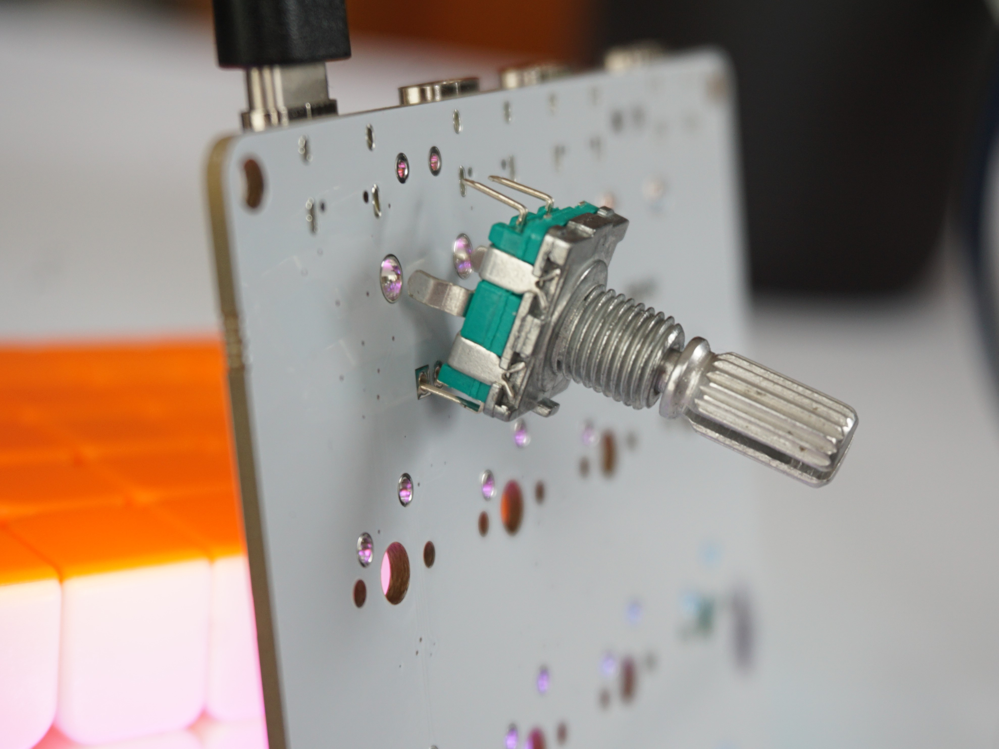

**Check the USB hub by connecting a device to each port, with cable orientated in both orientations.**  
You should see a your device appear on each port.

### **If there are any issues getting the above to work, please get in touch before proceeding to assemble the board.**

### Step 1: Solder Encoders

The first step in assembling your Hub16 is to solder the rotary encoders. Ensuring the pins are straight, insert the rotary encoders and tack in two pins on opposite corners.
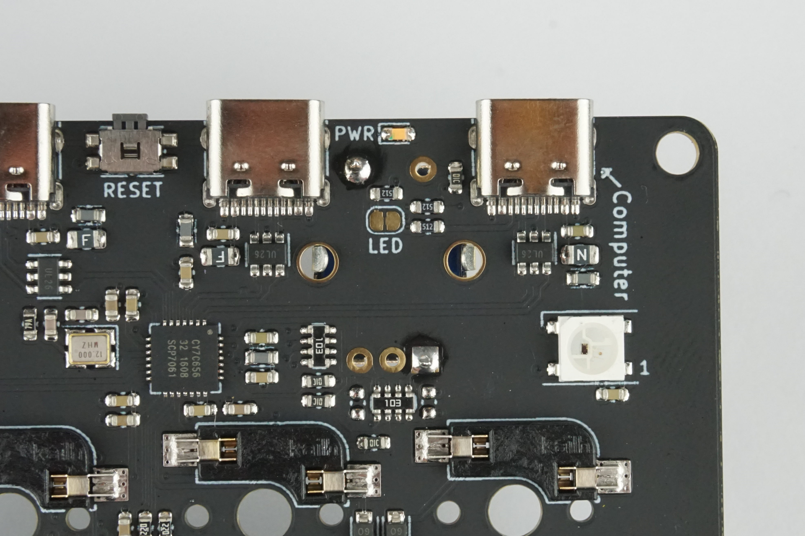

Before soldering in the remaining pins, ensure the encoder is perpendicular. If adjustments are required, heat one of the solder joints and gently push the encoder until it is seated. Repeat until you are satisfied with how the encoders look. (Hint: you shouldn't be able to see the encoder hiding on the other side of the board!)
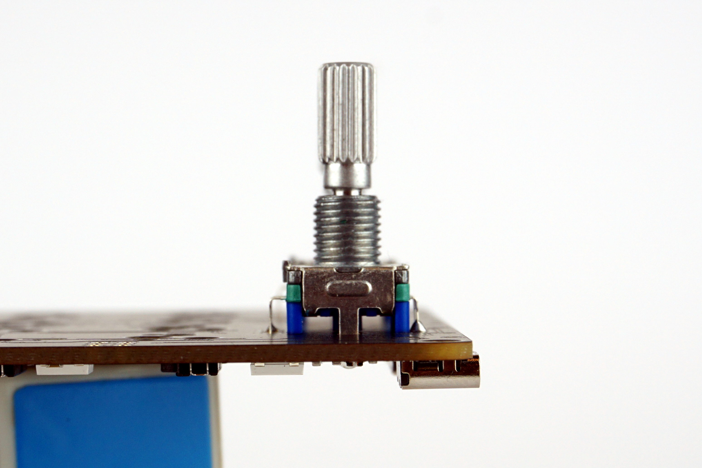

With your encoders in nice and square, solder the rest of the pins. I'd suggest soldering all of the smaller pins and checking everything is still square before soldering in the mechanical legs as they make it very hard to move the encoder.
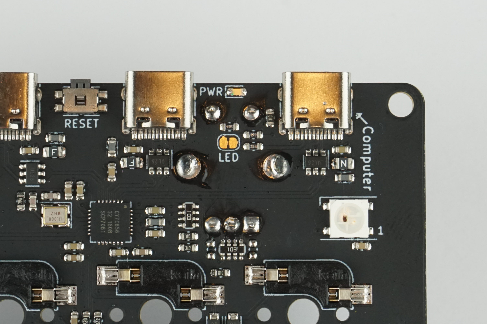

### Step 2: Assemble lower case

With the PCB soldered, the next step is to thread the standoffs into the longer screws through the bottom plate, adding in the incline spacer if desired. Just do this up touch tight, a little bit of movement will help later.
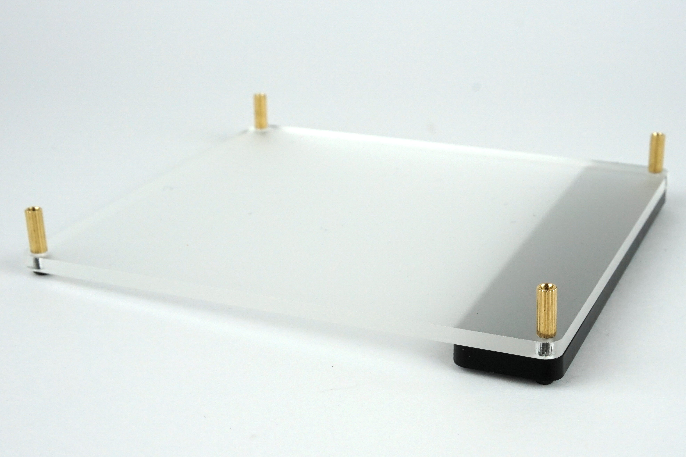

### Step 3: Add "U" shaped spacer

Add the "U" shaped spacer, ensuring the open end is facing the top of the case, as this is where the USB connectors will be located.
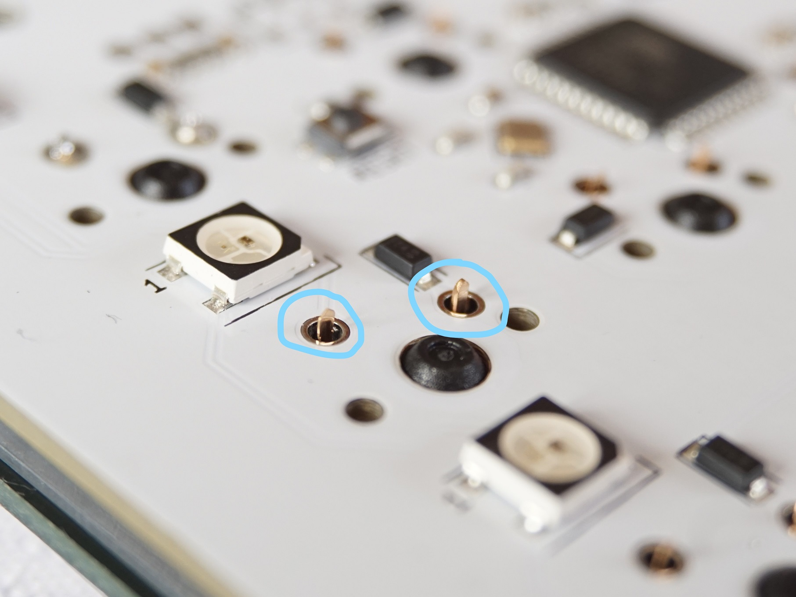

### Step 4: Place PCB into case

Next, place the PCB into the case, ensuring the USB connectors are on the same side at the missing part of the spacer. This may take some wiggling depending on how straight the standoffs are.
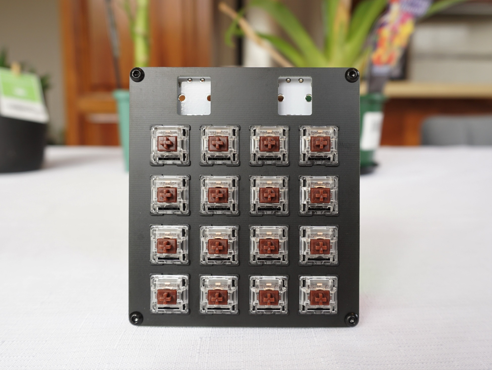

### Step 5: Add upper spacer

Place the remaining "O" shaped acrylic spacer on top of the PCB. It does not have a specific orientation.
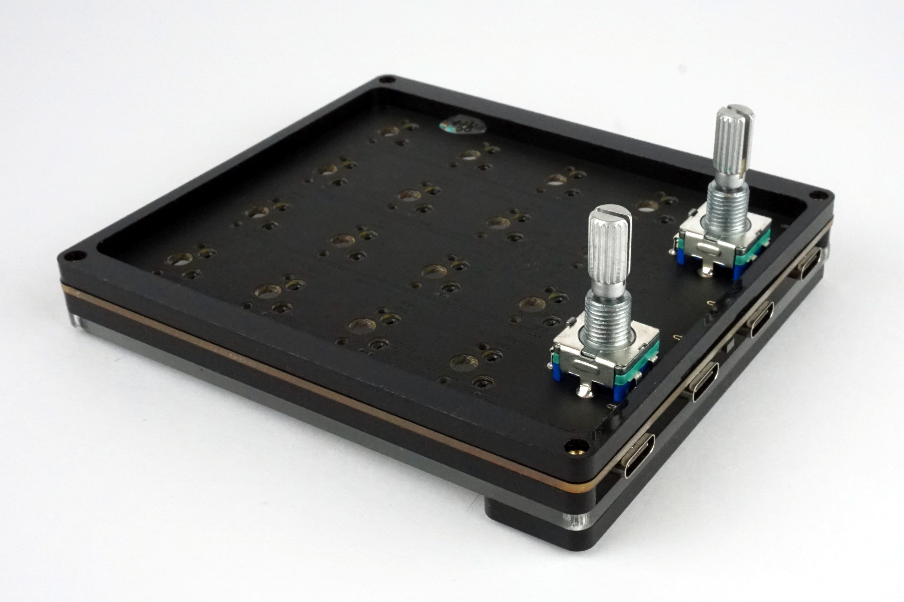

### Step 5: Add top plate and remaining bolts

Next place the PCB atop the assembly, choosing the side with less imperfections if required. Using your 1.5mm allen key, loosely thread bolts on before tightening the bottom bolts first, then finally torquing the upper bolts.
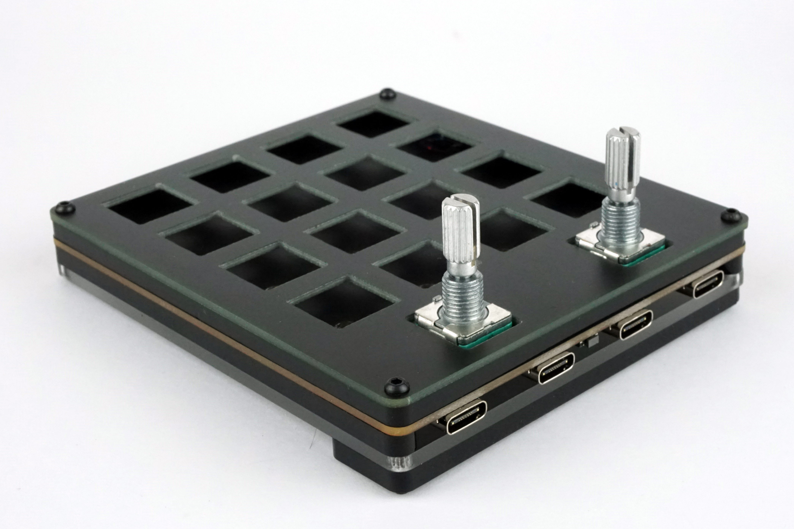

### Step 7: Add Keys

With those steps done, insert keys into their positions. If a key does not want to go in, confirm the pins are straight before giving it a firm push. Once all of the keys are in, check each works as the pins often get bent and require straightening before continuing.
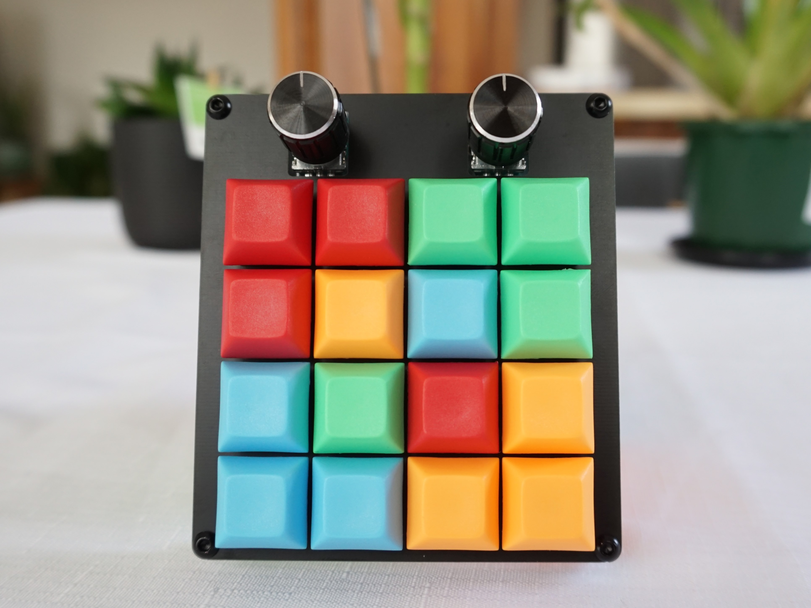

### Step 8: Add keycaps and encoder knob

Finally, fit your keycaps of choice and the encoder knobs, and you are done! Enjoy :D
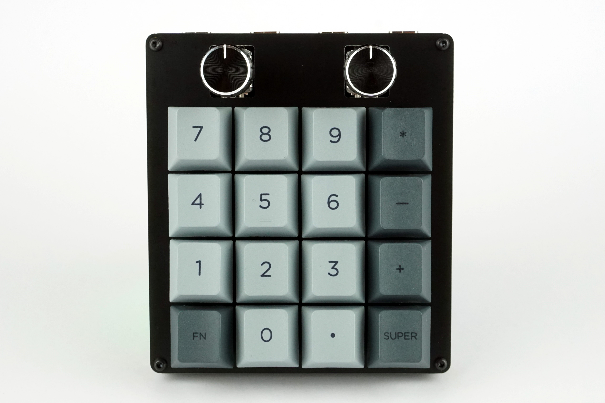

## Disabling Power LED

If you find the power LED annoying and would like to disable it, cut the jumper labeled LED near the USB ports. The easiest way to do this is to run a knife down the thin black gap between the two large pads. The LED can be re-enabled by soldering the jumper shut.

