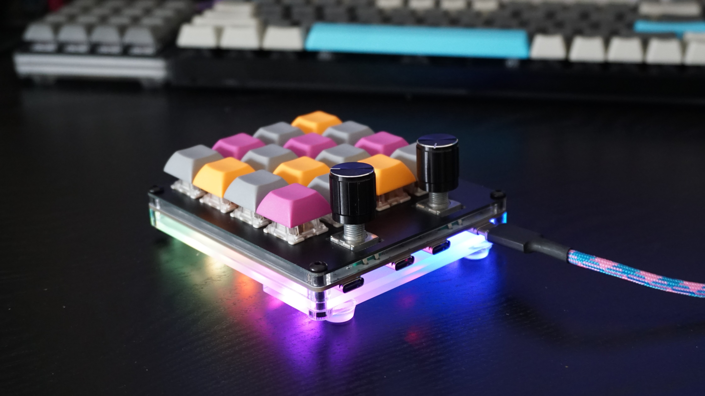

# Hub16

A macro pad with 16 keys, two rotary encoders, a four port USB hub, and plenty of LEDs!

This project started as I wanted to utilise rotary encoders to change the grid and trace size in KiCad, and then thought wouldn't it be cool to run a cable between the macro pad and keyboard, so a hub was added! 

It is designed to work with software on the host computer to enable powerful, context aware macros to be run, ensuring you never have to press a strange sequence of keys ever again. 

All design files required to manufacture the board and enclosure are available, along with assembled and tested boards being available from [Tindie](https://www.tindie.com/products/joshajohnson/hub16-programmable-macro-keyboard/) 

## Key Features
* 16 Cherry MX compatible switches, along with two switches in the encoders. 
* Two rotary encoders, bringing an intuitive interface for many controls such as volume and music playback.
* Four port USB 2.0 hub with Type-C connectors, allowing connection to other keyboards, memory sticks, wireless receivers and more! 
* Designed to interface with host computer to provide a level of interaction / macro control not available on standard keyboards, with examples provided for Windows and Linux. 
* Various case designs, allowing the Hub16 to fit in on any desk. 
* 11 individually addressable RGB LEDs for the bling factor. 
* Full QMK programmability and customisation. 

## Build Instructions
* [Keyboard Assembly](Documents/keyboard-assembly.md)
* [Firmware and Software Configuration](Documents/firmware-software-config.md) 

### Assembling the board from design files? 
* [PCB SMT Assembly Guide](Documents/smt-assembly.md)
* [Firmware Flashing Instructions](Documents/firmware-install.md)
* [Enclosure Manufacturing](Documents/enclosure-manufacturing.md)

### Errata
* Some rotary encoders output flipped signals (clockwise instead of counterclockwise), if after assembly your encoders appear to be sending the wrong signals, change the position of pins from line 87 to 89 (and vice-versa) in [config.h](Firmware/hub16/config.h), or alter the setting in your [software](Software).

If you have any questions or comments please get in touch. I can be found on Discord as `_joshajohnson#9451`, [Twitter](https://twitter.com/_joshajohnson), and [r/mk](https://www.reddit.com/user/_joshajohnson). 

Happy typing!
