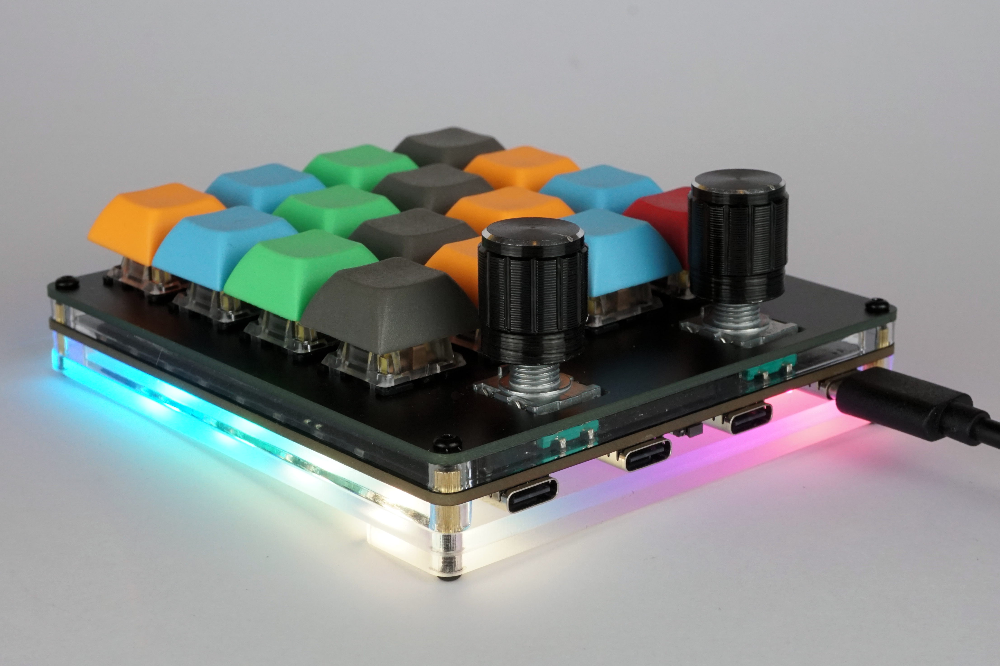
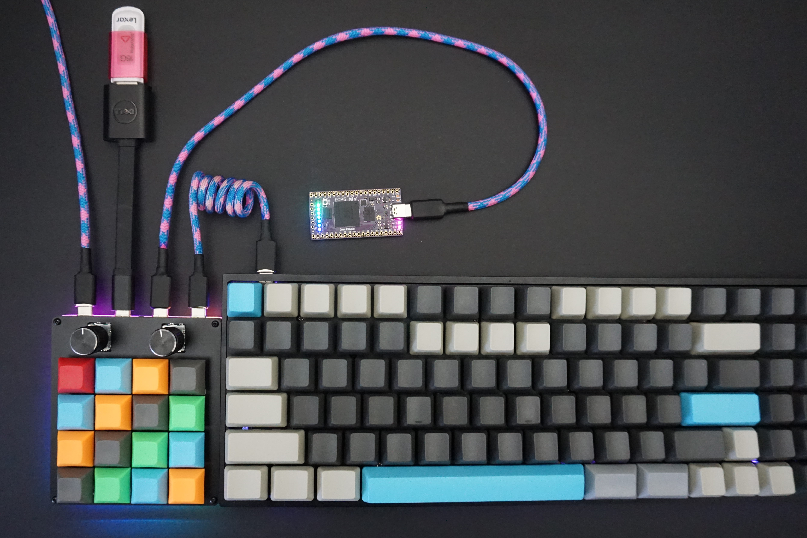

# Hub16

Hub16 is a macropad with a bunch of features you never knew you needed. They include:

- 16 Cherry MX compatible keys, along with switches in each encoder.
- Two rotary encoders, enabling intuitive controls for a wide range of tools including CAD and photo / video editing.
- Inbuilt USB 2.0 Hub with Type-C connectors, allowing connection to other keyboards, memory sticks, wireless receivers and more!
- VIA and QMK compatibility, including a "macro" mode enabling the keys to be dynamically remapped on a host computer.
- 11 addressable RGB LEDs to display state, or just light your desk up.

## Project Status

Project is stable, with assembled boards available at [Tindie](https://www.tindie.com/products/joshajohnson/hub16-programmable-macro-keyboard/).

## Getting Started Guide

- [Keyboard Assembly](Documents/keyboard-assembly.md)
- [VIA Keymap Configuration](Documents/via.md)
- [Macro Configuration](Documents/macro.md)

## Detailed Info

- [Advanced Firmware / Software Configuration](Documents/advanced-config.md)
- [PCB SMT Assembly Guide](Documents/pcba.md)
- [Enclosure Manufacturing](Documents/enclosure.md)

### Repo Contents

- `Documents` contains all documentation and images for the project.
- `Firmware` contains both the source and precompiled binaries for Hub16.
- `Hardware` contains the KiCad design files for the keyboard.
- `josh-kicad-lib` is my personal KiCad parts library which contains many of the parts used.
- `Mechanicals` contain the plate and case design for Hub16.
- `Production` contains all the files required to produce the PCB. It also contains test scripts and jigs.
- `Software` contains all the VIA config, along with template script to use Hub16 as a macropad with software on your computer.

### Notes on the USB Hub

The hub is a four port USB 2.0 Hub with Type-C connectors, aimed at allowing connection of keyboards, mice, memory sticks, wireless receivers, and other small devices (including a second Hub16!)  to your computer.

Due to cost and space constraints, the hub has some limitations. The hub **is not**:

- USB 3.x, Power Delivery, Thunderbolt, DisplayPort, etc compatible.
- Designed to charge your phone quickly. Only 100mA is guaranteed per port.
- Designed to work with power hungry devices such as spinning hard drives.
- Guaranteed to provide full USB 2.0 speeds and performance on all ports.

Might you be able to charge your phone whilst copying files at full speed of a spinning hard drive over a long cable? Maybe. However Hub16 is a macropad first, USB hub second, so if you are looking for a high performance device I'd suggest picking up a dedicated USB hub and just using Hub16 as a macropad.

### Errata

- Boards assembled in 2021 will have an issue with VIA where the LED controls are incorrect. [Follow these instructions to resolve](Documents/via.md)
- Boards purchased between June 12 and June 22 2020 will not go into the bootloader upon resting from software. Workaround: reset board with physical reset button on bottom of PCB. Fix: reflash the bootloader following [these instructions](Documents/advanced-config.md#Bootloader-Flashing).
- Firmware builds prior to 27th June do not continually send characters when the encoders are depressed.
- Firmware builds prior to 9th June have issues with the bottom right key `p` not functioning correctly.
- Some rotary encoders output flipped signals (clockwise instead of counterclockwise), if after assembly your encoders appear to be sending the wrong signals, comment in line 84 in [config.h](Firmware/hub16/config.h), or alter the setting in your [software](Software).

If you have any questions or comments please get in touch. Asking in the [No Sharp Corners Discord](nosharpcorners.com) Discord or opening an issue / pull request will result in the quickest response.
